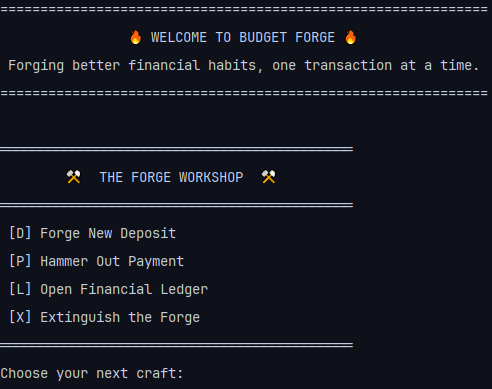
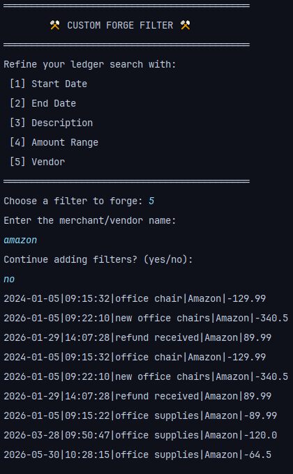
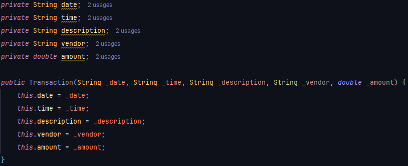

# 🔥 Budget Forge

Budget Forge is a command-line Java application for tracking personal or business financial transactions. It allows users to record deposits and payments, store them in a CSV file, and generate financial reports based on date ranges, by vendor, or even make your own custom search.

The application is designed to simulate a simple ledger system where all transactions are persisted and can be reviewed at any time.

---

## 📌 Features
- 

- Add deposits (income transactions)
- Make payments (expense transactions)
- View full transaction ledger

### 🔍 Built-in Filters
- Month to Date
- Previous Month
- Year to Date
- Previous Year
- Search by vendor (alphabetical order)

### 🛠️ Custom Filter Search
- Start date and end date
- Transaction description
- Transaction vendor
- Minimum and maximum amount

- 

- Transactions are saved to a CSV file for persistence
- Automatic loading of past transactions on startup

---

## 🧱 Tech Stack

- Java
- File I/O (BufferedReader / BufferedWriter)
- ArrayList
- Object-Oriented Programming (OOP)

- - 

```
---

## 📁 Project Structure


AccountingLedgerApp (Budget Forge)
│
├── src/
│   └── main/
│       ├── java/
│       │   └── com/pluralsight/
│       │       ├── models/        # Data classes
│       │       │   └── Transaction.java
│       │       │
│       │       ├── services/      # Business logic
│       │       │   ├── LedgerService.java
│       │       │   ├── ReportService.java
│       │       │   └── TransactionFileService.java
│       │       │
│       │       ├── ui/            # CLI screens
│       │       │   ├── HomeScreen.java
│       │       │   ├── LedgerScreen.java
│       │       │   └── ReportScreen.java
│       │       │
│       │       └── utils/         # Helper utilities
│       │           ├── DateUtils.java
│       │           ├── InputHelper.java
│       │           └── WriteAndReadCSV.java
│       │
│       ├── README.md
│       │
        └── transactions.csv

           
  
---
```
## ▶️ How to Run the Project
```
1. Clone the repository: git clone https://github.com/BlaineBell21/AccountingLedgerApp.git
```

2. Open the project in IntelliJ IDEA (or your preferred Java IDE)
3. Run the App class
4. Follow the CLI menu prompts to navigate the application

## 📄 CSV Format

All transactions are stored in:


Each transaction follows this format:

date|time|description|vendor|amount

Example:


    2026-04-15|10:13:25|Office Supplies|Staples|-45.99


## 🧠 Key Learning Concepts

This project demonstrates:

- File reading and writing in Java
- Data persistence using CSV files
- ArrayList manipulation
- Filtering and sorting data
- Menu-driven CLI design
- Object-oriented programming principles

## 👨‍💻 Blaine Anthony Bell

Built as part of a capstone project in Year Up United's Learn To Code Academy(LTCA).

---
